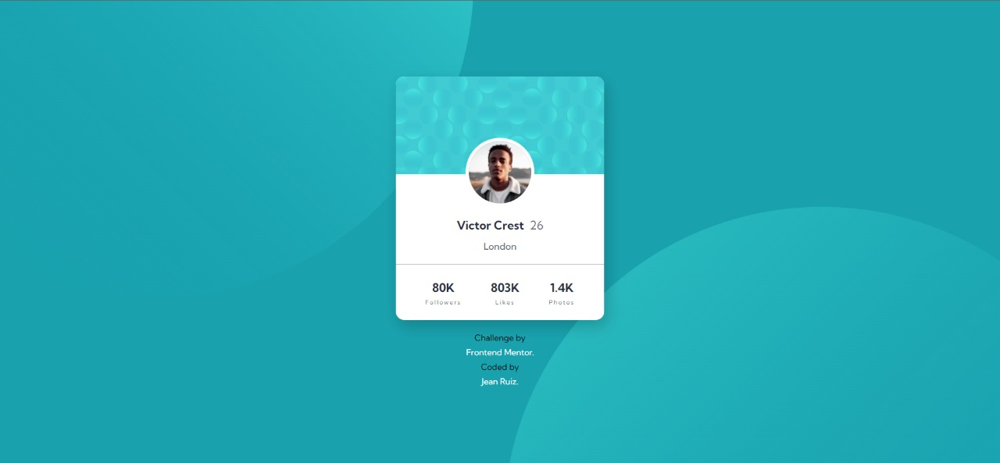

# Frontend Mentor - Profile card component solution

This is a solution to the [Profile card component challenge on Frontend Mentor](https://www.frontendmentor.io/challenges/profile-card-component-cfArpWshJ). Frontend Mentor challenges help you improve your coding skills by building realistic projects.

## Table of contents

- [Overview](#overview)
  - [The challenge](#the-challenge)
  - [Screenshot](#screenshot)
  - [Links](#links)
- [My process](#my-process)
  - [Built with](#built-with)
- [Author](#author)

**Note: Delete this note and update the table of contents based on what sections you keep.**

## Overview

### The challenge

- Build out the project to the designs provided

### Screenshot

### Links

- Solution URL: [https://github.com/Jean-FrontEnd/profile-card](https://github.com/Jean-FrontEnd/profile-card)
- Live Site URL: [https://jean-frontend.github.io/profile-card/](https://jean-frontend.github.io/profile-card/)

## My process

### Built with

- Semantic HTML5 markup
- CSS custom properties
- Flexbox

## Author

- Website - [Jean Ruiz](https://github.com/Jean-FrontEnd)
- Frontend Mentor - [@Jean-FrontEnd](https://www.frontendmentor.io/profile/Jean-FrontEnd)
- Instagram - [@jeanfrontend](https://www.instagram.com/jeanfrontend/)
